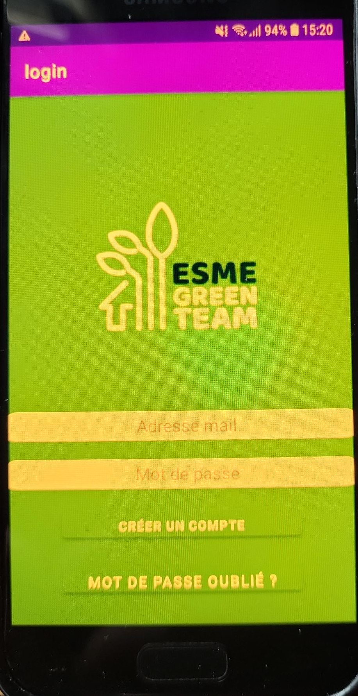
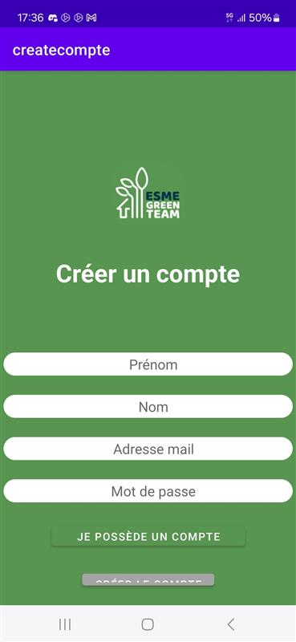
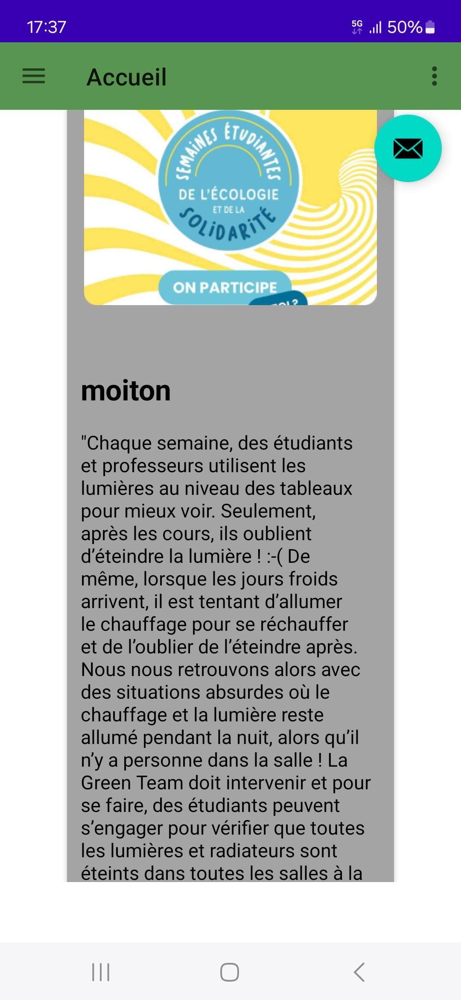
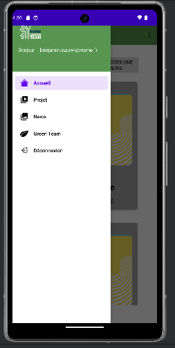
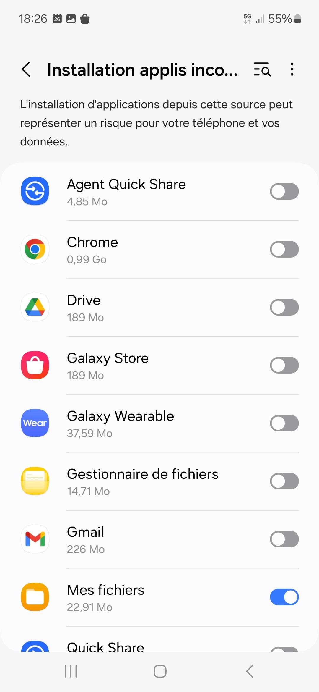

# Application GreenTeam

Notre objectif est de créer une application pour l’association **GreenTeam** (association de notre école).  
Cette application a pour but d’aider les étudiants à communiquer et à participer aux actions visant à **réduire la consommation énergétique** de l’école.

  

---

## 💡 À propos du projet

Le projet a été réalisé sur **Android Studio** en **Java**.  
L’objectif principal était de nous confronter à la **création d’une application mobile**.  
Ainsi, l’application est **disponible uniquement pour les utilisateurs Android** (nous avons découvert cela un peu tardivement… l’idéal aurait été d’utiliser **Flutter** et **Dart** dès le début 😅).

Le projet n’étant plus à jour, il est probable que certains éléments graphiques présentent des problèmes d’affichage sur les **nouvelles générations de téléphones** (obsolescence).

  
 <em>Exemple d’obsolescence sur la page d’accueil (vous ne voyez pas le problème ? Regardez bien 👀)</em>

🕵️‍♂️ Vous ne voyez vraiment pas ?

Le **bouton de validation** est caché à cause d’une taille d’écran non prévue !  
Nous avons ensuite corrigé cela en adaptant l’affichage à la taille de l’écran — un bon exemple des difficultés rencontrées pendant le développement.

---

## ⚙️ Fonctionnalités

Nous avons réalisé plusieurs tests et sommes parvenus à lancer l’application sur nos téléphones.  
Voici les principales fonctionnalités développées :

- Page d’**authentification / création de compte** (liée à **Firebase**)  
- Système de **visualisation des propositions** pour tous les utilisateurs  
- Gestion des **demandes administratives** pour les administrateurs  

|  |  |  |
|:---------------------------:|:---------------------------:|:---------------------------:|
| Page de création de compte | Types de propositions affichées | Bandeau |

---

## 📱 Installation de l’application

### 1. Autoriser l’installation depuis des sources inconnues

Avant toute chose, il faut autoriser votre téléphone à installer des applications depuis vos fichiers.  
Allez dans les **paramètres** et recherchez :  
> *Installer une application inconnue*  

Puis, dans la liste, sélectionnez votre **gestionnaire de fichiers** et **activez l’autorisation**.

   
  <em>Activation du gestionnaire de fichiers</em>

### 2. Installer l’APK

Une fois l’autorisation activée, vous pouvez installer l’application en téléchargeant le fichier suivant :

📦 [**Télécharger l’application Android**](assets_readme/app-release.apk)

---

## 👥 Équipe

Projet étudiant réalisé en 2024 dans le cadre de nos études.
Nous nous sommes aidés d'IA pour réaliser ce projet (chatGPT pour ne citer que lui), mais également pour écrire ce README.

